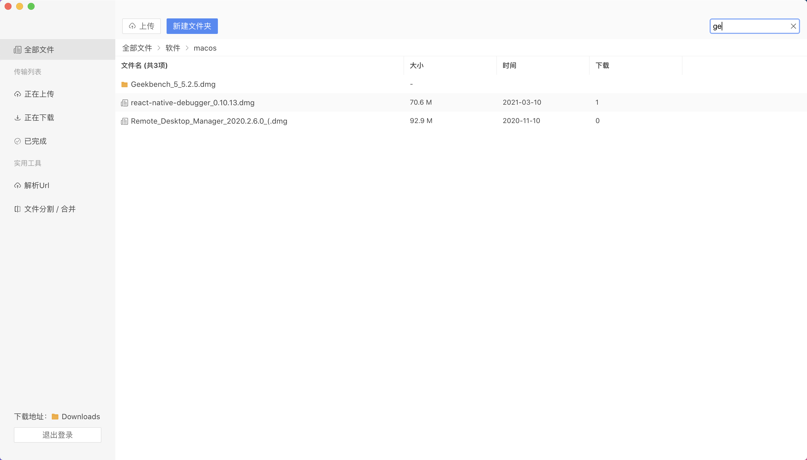
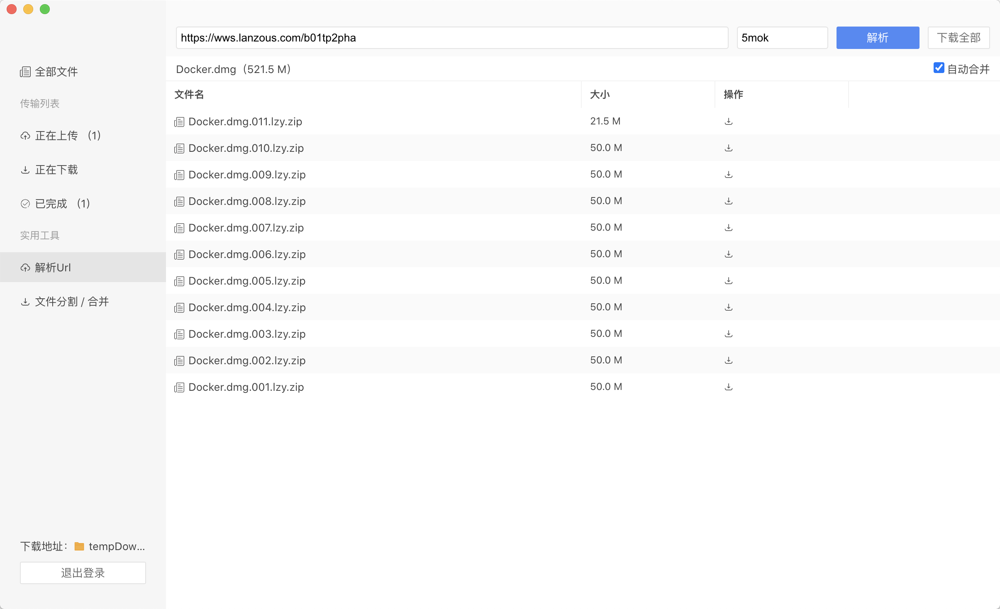

## 界面速览





## 下载地址

macos：[蓝奏云盘 https://wwe.lanzoui.com/b01tpeg7i](https://wwe.lanzoui.com/b01tpeg7i)

windows：[蓝奏云盘 https://wwe.lanzoui.com/b01ujia0j](https://wwe.lanzoui.com/b01ujia0j) 密码: 236q

## 功能

* [x] 批量上传 / 下载；
* [x] URL 解析，自动合并文件；
* [x] 任意格式、大文件上传，支持断点功能；
* [x] 快速分享，一件复制分享信息到粘贴板。

## 构建

下载项目

```
git clone https://github.com/chenhb23/lanzouyun-disk.git
```

安装依赖

```
yarn
```

macos / windows 构建

```
yarn build
```

## 说明

- 目前已测试 `macos`、 `windows` 平台，可到 release 页面下载。另外，项目总体完成，~~开源在即~~(已开源)。
- 本项目旨在学习 `electron` 桌面应用的开发，使用本软件所造成的一切后果与本人无关。
