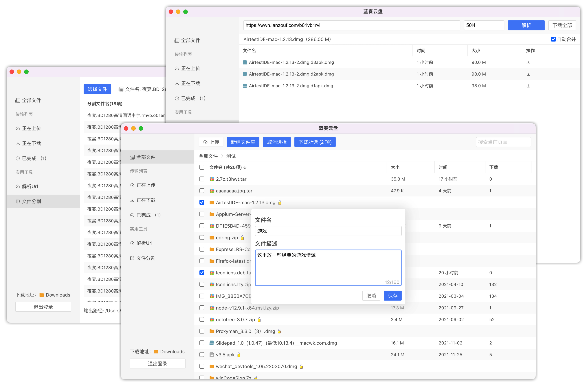

# 蓝奏云盘 

v2 版本已发布！

## 界面预览



## 说明

- v2 升级 `electron` 框架至 18.0.4 版本，支持 `windows`, `macos-x64` 和 `macos-arm64`(新增) 平台；
- 删除 v1 版本的 `.lzy.zip` 后缀标记，v2 采用随机后缀来标记文件（兼容 v1 版本）；
- ~~（新）禁止上传超大文件，否则有可能会被限制上传功能！~~ 一天后又可以上传了，可能是系统临时抽搐。

## 功能

* [x] 大文件上传、支持任意格式、支持断点功能；
* [x] 排序和查找功能，可多选 / 全选文件(夹)，快速下载；
* [x] 一键快速复制分享链接到粘贴板；
* [x] 分享链接解析，自动合并文件；
* [x] 文件(夹)编辑功能。

## 下载地址

https://wwn.lanzouf.com/b01tpefuf
密码:4hol

## 本地开发

下载项目

```
git clone https://github.com/chenhb23/lanzouyun-disk.git
cd lanzouyun-disk
```

安装依赖

```
yarn
```

启动服务

```
yarn start
```

## 声明

本项目旨在学习 `electron` 桌面应用的开发，使用本软件所造成的一切后果与本人无关。
