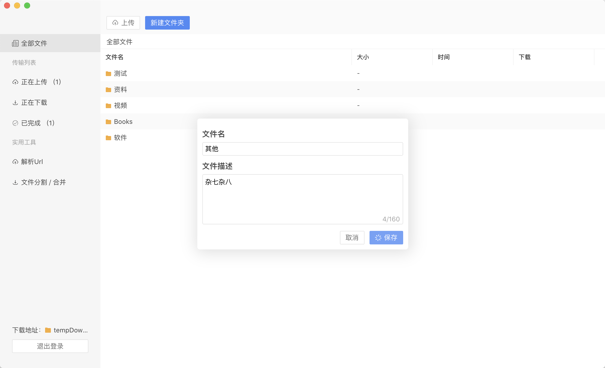

## 界面速预

## 下载地址

下载地址：[蓝奏云盘 https://wws.lanzous.com/b01tpeg7i](https://wws.lanzous.com/b01tpeg7i)

## 功能

* [x] 批量上传 / 下载；
* [x] URL 解析，自动合并文件；
* [x] 任意格式、大文件上传，支持断点功能；
* [x] 快速分享，一件复制分享信息到粘贴板。

## 说明

- 目前仅测试了 `macos` 系统，`linux` 和 `windows` 系统正在适配中，请耐心等待。另外，项目总体完成，开源在即。
- 本项目旨在学习 `electron` 桌面应用的开发，使用本软件所造成的一切后果与本人无关。
